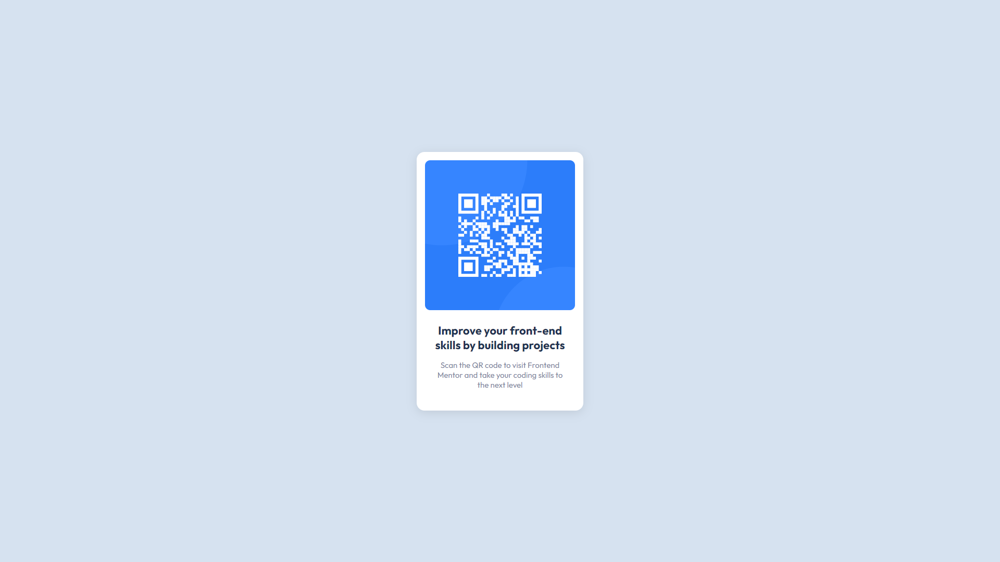

# Frontend Mentor - QR code component solution

This is a solution to the [QR code component challenge on Frontend Mentor](https://www.frontendmentor.io/challenges/qr-code-component-iux_sIO_H). Frontend Mentor challenges help you improve your coding skills by building realistic projects. 

## Table of contents

- [Overview](#overview)
  - [Screenshot](#screenshot)
  - [Links](#links)
- [My process](#my-process)
  - [Built with](#built-with)
  - [What I learned](#what-i-learned)
  - [Continued development](#continued-development)
  - [Useful resources](#useful-resources)
- [Author](#author)

## Overview

### Screenshot

### Links

- [Solution URL](https://www.frontendmentor.io/challenges/qr-code-component-iux_sIO_H/hub/flexbox-qr-code-component-4eNlz0Weev)
- [Live site URL](http://kapline.me/qr-code-component-main/)

## My process

### Built with

- Semantic HTML5 markup
- CSS custom properties
- Flexbox
- GitHub Pages

### What I learned

I have strengthened my knowledge of Flexbox and understanding of CSS.

### Continued development

In the future, I'd wanted to master adaptive and responsive design

### Useful resources

- [Flexbox Froggy](https://flexboxfroggy.com) - Very helpful tutorial game for understanding Flexbox

## Author

- Frontend Mentor - [@TrueKapline](https://www.frontendmentor.io/profile/TrueKapline)